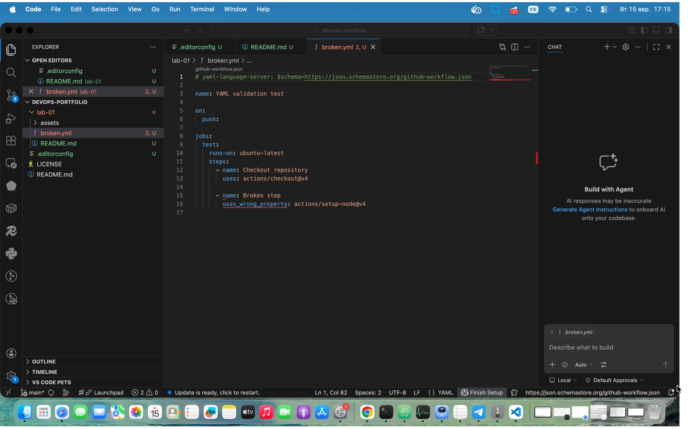
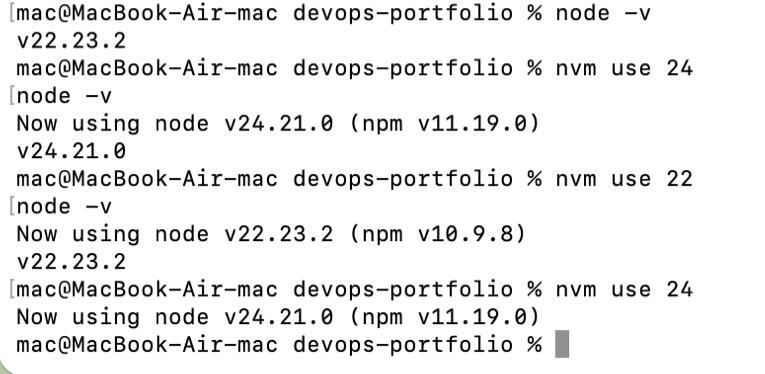

# Лабораторна робота №1

## Завдання 1. Git і редактор

### Глобальні параметри Git

Для роботи з Git було налаштовано такі глобальні параметри:

```text
user.email=kushnirchuk.oleksandr@chnu.edu.ua
user.name=KushnirchukOleksandr
filter.lfs.clean=git-lfs clean -- %f
filter.lfs.smudge=git-lfs smudge -- %f
filter.lfs.process=git-lfs filter-process
filter.lfs.required=true
init.defaultbranch=main
core.autocrlf=input
core.editor=code --wait
pull.rebase=true
```

Параметр `init.defaultBranch=main` задає назву `main` для початкової гілки нових Git-репозиторіїв.

Параметр `core.editor=code --wait` задає Visual Studio Code як редактор, який Git може використовувати, наприклад, для введення повідомлень комітів.

### core.autocrlf

У різних операційних системах використовуються різні символи кінця рядка. У Windows поширений формат CRLF, а в Unix-подібних системах, зокрема Linux та macOS, використовується LF.

На macOS встановлено:

```text
core.autocrlf=input
```

При такому значенні Git під час коміту перетворює CRLF у LF, але не виконує зворотне перетворення LF у CRLF під час отримання файлів із репозиторію. Це дозволяє зберігати в репозиторії однакові закінчення рядків.

У Windows часто використовується `core.autocrlf=true`. У цьому випадку Git перетворює LF у CRLF при checkout та CRLF у LF при коміті.

Якщо не контролювати закінчення рядків у команді, де використовуються різні операційні системи, Git може сприймати зміну CRLF/LF як зміну рядків файлу. Через це можуть виникати зайві зміни у `diff` та непотрібні конфлікти.

### pull.rebase=true

Типовий `git pull` отримує зміни з віддаленого репозиторію та інтегрує їх у локальну гілку. Якщо локальна та віддалена історії розійшлися, при merge-стратегії може бути створений додатковий merge-коміт.

При:

```text
pull.rebase=true
```

локальні коміти тимчасово прибираються, отримуються нові коміти з віддаленої гілки, після чого локальні коміти послідовно застосовуються поверх них.

Завдяки цьому історія Git залишається більш лінійною та не містить зайвих merge-комітів після звичайного `git pull`.

### Налаштування редактора

Для роботи використовується Visual Studio Code. Встановлено підтримку:

- історії змін та авторства рядків;
- Dockerfile і Docker Compose;
- YAML із перевіркою за схемою;
- EditorConfig;
- Markdown.

Для перевірки YAML було створено навмисно некоректний файл та підключено схему GitHub Actions. Visual Studio Code успішно виявив помилку в конфігурації.



### EditorConfig

У корені репозиторію створено файл `.editorconfig` з такими налаштуваннями:

```ini
root = true

[*]
charset = utf-8
end_of_line = lf
insert_final_newline = true
indent_style = space
indent_size = 2
trim_trailing_whitespace = true

[*.md]
trim_trailing_whitespace = false
```

Файл задає єдині правила форматування: кодування UTF-8, закінчення рядків LF, відступ у 2 пробіли та фінальний перенос рядка.


## Завдання 2. Середовища виконання

### Node.js

Для керування версіями Node.js використовується менеджер версій `nvm`.

Встановлена версія `nvm`:

```text
nvm 0.40.7
```

Через `nvm` встановлено актуальну LTS-версію Node.js:

```text
Node.js v24.21.0
npm 11.19.0
```

Також для демонстрації роботи менеджера версій було встановлено Node.js `v22.23.2`.

Перемикання між версіями виконується командами:

```bash
nvm use 24
node -v

nvm use 22
node -v
```

Результат перемикання між Node.js 24 та Node.js 22:



### Навіщо потрібен менеджер версій

Різні проєкти можуть вимагати різні версії одного середовища виконання. Наприклад, новий проєкт може використовувати актуальну LTS-версію Node.js, тоді як старіший проєкт може бути сумісним лише з попередньою версією.

Менеджер версій дозволяє встановити на одному комп'ютері декілька версій Node.js та швидко перемикатися між ними без перевстановлення Node.js. Це дозволяє використовувати для кожного проєкту сумісну з ним версію середовища та уникати конфліктів між проєктами.

### Python

Для керування Python використовується `uv`.

Встановлені версії:

```text
uv 0.12.14
Python 3.14.7
```

Python 3.14.7 встановлений та запускається через `uv`. Перевірка версії виконується командою:

```bash
uv run python --version
```

Результат:

```text
Python 3.14.7
```

### Контейнеризація

Для роботи з контейнерами використовується Docker.

Встановлена версія Docker:

```text
Docker version 29.2.0, build 0b9d198
```

Також встановлений Docker Compose. Перевірка виконується командою:

```bash
docker compose version
```

Результат:

```text
Docker Compose version v5.0.2
```

Використовується команда `docker compose` з пробілом, тобто сучасний Compose, а не застаріла окрема команда `docker-compose`.

### Версії інструментів

Для перевірки середовища було виконано:

```bash
nvm --version
node --version
npm --version
uv --version
uv run python --version
docker --version
docker compose version
```

Отримано:

```text
0.40.7
v24.21.0
11.19.0
uv 0.12.14 (Homebrew 2026-09-15 aarch64-apple-darwin)
Python 3.14.7
Docker version 29.2.0, build 0b9d198
Docker Compose version v5.0.2
```

## Завдання 3. GitHub і доступ

### Профіль GitHub

Профіль GitHub було заповнено необхідною інформацією:

- ім'я;
- фото профілю;
- короткий опис (Bio).

Для захисту облікового запису було увімкнено двофакторну автентифікацію (2FA) за допомогою застосунку Google Authenticator. Recovery codes збережено окремо в безпечному місці.

### SSH-доступ

Для автентифікації на GitHub було створено SSH-ключ типу `ed25519`, захищений парольною фразою.

Публічну частину SSH-ключа було додано до GitHub-акаунта. Приватна частина ключа зберігається лише локально та не передається до GitHub або репозиторію.

Для перевірки SSH-з'єднання виконано:

```bash
ssh -T git@github.com
```

Результат:

```text
Hi KushOleks! You've successfully authenticated, but GitHub does not provide shell access.
```

Отже, автентифікація через SSH налаштована успішно.

### Чому приватний SSH-ключ не можна додавати в репозиторій

Приватний SSH-ключ є секретною частиною пари ключів і використовується для підтвердження особи власника. Він повинен зберігатися тільки на довіреному пристрої користувача.

У репозиторій можна додавати лише публічний ключ, якщо це необхідно. Приватний ключ не можна комітити навіть у приватний репозиторій, оскільки він може потрапити до історії Git, резервних копій, логів або стати доступним іншим користувачам.

Якщо зловмисник отримає приватний ключ та зможе ним скористатися, він потенційно зможе автентифікуватися від імені власника ключа.

### Що робити, якщо приватний ключ потрапив у репозиторій

Якщо приватний SSH-ключ випадково потрапив у репозиторій, необхідно діяти так:

1. Вважати цей ключ скомпрометованим і більше не використовувати його.
2. Видалити відповідний публічний ключ з GitHub у налаштуваннях SSH keys, щоб відкликати доступ старого ключа.
3. Створити нову пару SSH-ключів із новою парольною фразою.
4. Додати новий публічний ключ до GitHub та перевірити SSH-з'єднання.
5. Видалити приватний ключ не тільки з поточного стану репозиторію, але й з історії Git, якщо він уже був закомічений.
6. Якщо репозиторій уже був опублікований або доступний іншим користувачам, не вважати видалення ключа з історії достатнім заходом: старий ключ все одно залишається скомпрометованим і повинен бути відкликаний.
7. Перевірити репозиторій на наявність інших секретних даних та переконатися, що подібні файли виключені з відстеження Git, наприклад за допомогою `.gitignore`.


## Завдання 4. Репозиторій-портфоліо

Для виконання лабораторної роботи було створено публічний GitHub-репозиторій `devops-portfolio`, який використовується як портфоліо робіт з курсу DevOps.

### README портфоліо

У корені репозиторію створено та оформлено файл `README.md`.

У ньому вказано:

- коротке представлення;
- професійну мету в DevOps;
- технології та інструменти, з якими вже є досвід;
- технології, які планується вивчити;
- план професійного розвитку на найближчий рік;
- контактну інформацію.

Кореневий `README.md` оформлено як публічне портфоліо, яке може бути використане для демонстрації практичних навичок та прогресу під час вивчення DevOps.

### Структура репозиторію

Для робіт курсу було підготовлено таку структуру каталогів:

```text
devops-portfolio/
├── lab-01/
├── lab-02/
├── lab-03/
├── lab-04/
├── lab-05/
├── lab-06/
├── lab-07/
├── lab-08/
├── lab-09/
├── lab-10/
└── final/
```

Каталоги `lab-XX` призначені для практичних і лабораторних робіт, які будуть виконуватися протягом курсу.

Каталог `final` зарезервований для підсумкового проєкту курсу.

Оскільки Git не відстежує порожні каталоги, у ще не використані каталоги було додано службові файли `.gitkeep`.

### .gitignore

Файл `.gitignore` було не написано вручну, а згенеровано за допомогою генератора Toptal gitignore.io.

Для генерації використано шаблони:

- macOS;
- Visual Studio Code;
- Node.js;
- Python.

Файл було згенеровано командою:

```bash
curl -L "https://www.toptal.com/developers/gitignore/api/macos,visualstudiocode,node,python" -o .gitignore
```

Згенерований `.gitignore` виключає з відстеження Git службові та тимчасові файли операційної системи, редактора коду, Node.js та Python.

### Ліцензія

Для репозиторію обрано `MIT License`.

MIT License обрано тому, що це проста permissive-ліцензія, яка дозволяє вільно використовувати, змінювати та поширювати код зі збереженням повідомлення про авторські права.


## Завдання 5. Правила репозиторію

### Захист гілки main

Для основної гілки `main` було створено GitHub Ruleset `Protect main`.

Ruleset застосовується до default branch репозиторію та має статус `Active`.

Налаштовано такі правила:

- `Require a pull request before merging` — зміни до `main` повинні проходити через Pull Request;
- `Restrict deletions` — заборонено видалення основної гілки;
- `Block force pushes` — заборонено переписування історії за допомогою force push;
- `Require linear history` — історія основної гілки повинна залишатися лінійною.

Кількість обов'язкових схвалень Pull Request встановлено в `0`, оскільки репозиторій персональний і обов'язкова рецензія заблокувала б автору можливість самостійно виконувати злиття.

Обов'язкові status checks поки не налаштовувалися, оскільки CI-конвеєр на цьому етапі курсу ще відсутній.

### Робота в команді

У командному репозиторії кількість обов'язкових схвалень Pull Request доцільно збільшити щонайменше до одного та призначити інших учасників команди рецензентами. Також після появи CI/CD необхідно увімкнути обов'язкове проходження status checks перед злиттям змін.

Заборона обходу правил адміністратором є корисною в командній роботі, оскільки однакові правила застосовуються до всіх учасників і захищають основну гілку від випадкового або навмисного обходу процесу перевірки. У персональному репозиторії така заборона може бути шкідливою, оскільки єдиний власник репозиторію може заблокувати самому собі можливість виправити нестандартну або аварійну ситуацію.

### Шаблон Pull Request

Створено файл:

```text
.github/pull_request_template.md
```

Шаблон містить:

- опис змін;
- посилання на пов'язану задачу;
- чек-лист самоперевірки;
- опис способу перевірки результату.

Для перевірки Git workflow зміни лабораторної роботи виконувалися в окремій гілці `lab-01-setup` та були інтегровані в `main` через Pull Request.

### Дошка проєкту

Створено GitHub Project `DevOps Course` з такими статусами:

```text
Backlog → In Progress → Review → Done
```

Налаштовано вбудовані автоматизації GitHub Projects:

- нова відкрита Issue автоматично додається до Project та отримує статус `Backlog`;
- при прив'язуванні Pull Request до відповідної Issue задача переходить у `Review`;
- після злиття Pull Request елемент переходить у `Done`;
- після закриття Issue елемент переходить у `Done`.

В доступних вбудованих GitHub Projects workflows перехід до `Review` реалізовано через подію `Pull request linked to issue`, яка відповідає етапу передачі виконаної задачі на перевірку.

### Перевірка workflow

Для перевірки було створено Issue `Lab 01: Environment and professional Git workflow`.

Після створення Issue автоматично з'явилася в колонці `Backlog`. Після прив'язування Pull Request до Issue задача автоматично перейшла до `Review`. Після виконання `Squash and merge` Pull Request було успішно злито в захищену гілку `main`, а задача автоматично перейшла до `Done`.

Таким чином, налаштований workflow було перевірено на практиці.
